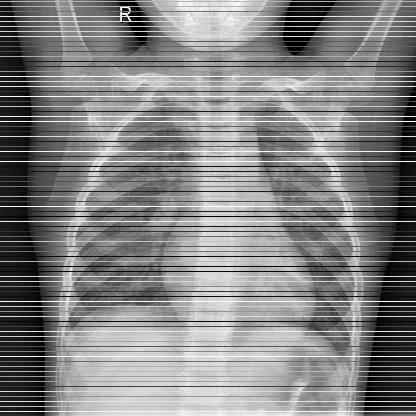

# Data Augmentation on Medical Images
This repository contains code for a method of image augmentation, designed to enhance the diversity of images used in training machine learning models.
We inserted random lines with random colors into images to balance the dataset:

    

## Project Structure
- "code/pneumonia/data_augmentation" for applying augmentation on images for pneumonia dataset
- "code/pneumonia/Model_ResNet" train and test models with augmented images  for pneumonia dataset
- "code/pneumonia/Model_for_Test" train and test models with augmented images  for pneumonia dataset

- "code/breast_cancer/aug_and_test" for applying augmentation on images, training and test for breast cancer dataset

